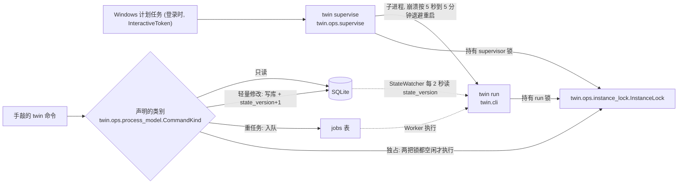
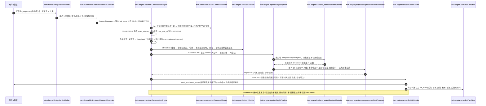
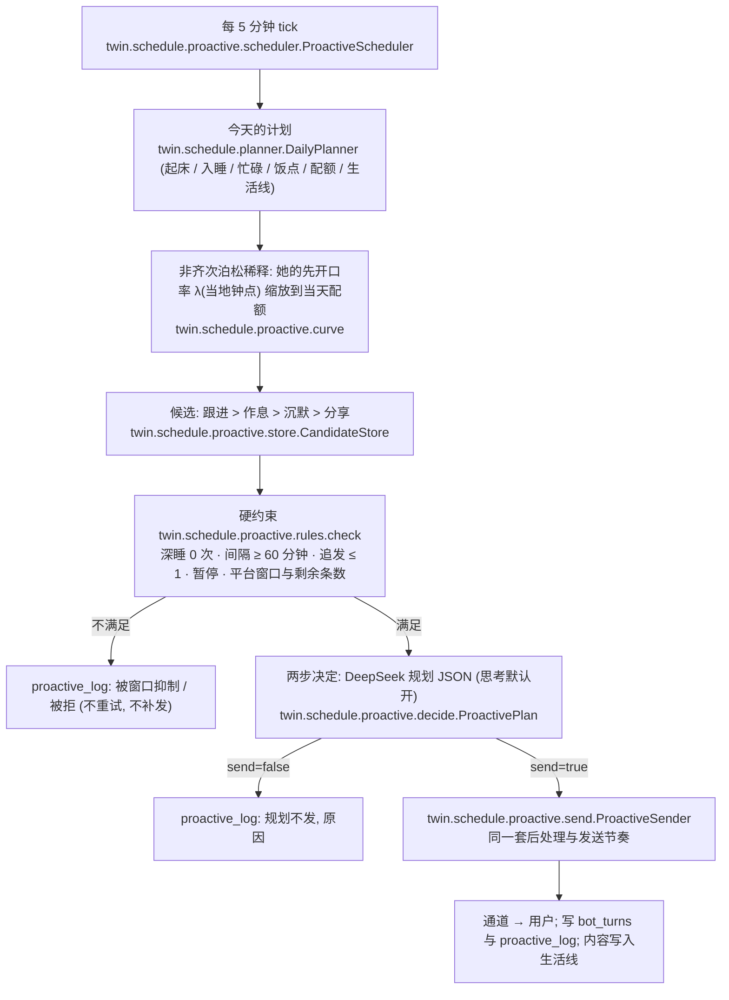
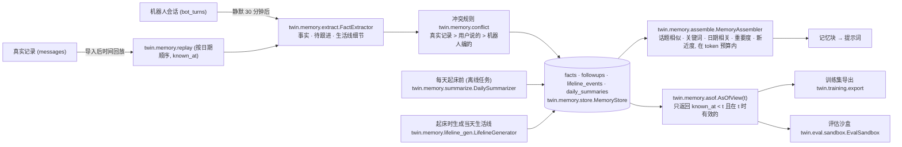
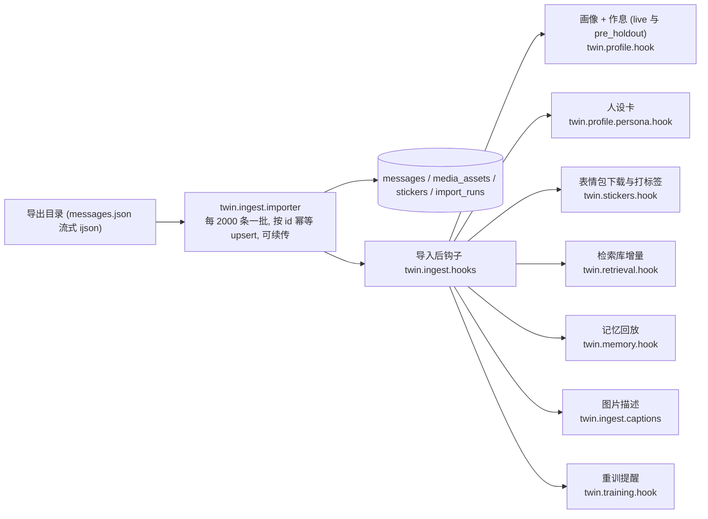
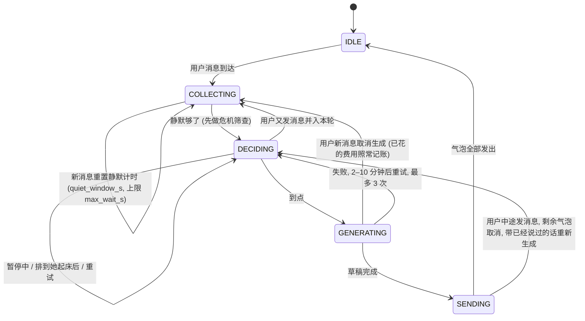

# 架构（ARCHITECTURE）

> 这份文档描述 wechat-twin 现在**实际是什么样**：组件、数据怎么流、对话状态机、表结构、关键设计决策。需求的唯一事实源是 [`SPEC.md`](SPEC.md)；每个取舍的理由与证据在 [`DECISIONS.md`](DECISIONS.md)（下面写作 D-nnn）。
> 图里和正文里以 `twin.` 开头的名字都是真实存在的模块、类或函数：`tests/unit/test_docs_architecture.py` 逐个核对 Mermaid 里的名字，并核对状态机的状态、表清单和决策编号。

## 1. 一页纸总览

一个人使用的单进程 asyncio 应用（R-ARCH-001）：

- **通道层**只收发：把微信 ClawBot（iLink 协议）或终端变成统一的 `Channel` 接口，只认已绑定的唯一用户（R-CH-007）。
- **人设引擎**是核心：会话状态机、真实模式决策（睡觉不回、忙碌延迟）、提示词组装、三种生成后端、后处理、拟人发送节奏；主动消息调度；指令与学习。
- **两个模型只负责生成**：DeepSeek（理解、记忆、规划、看图与默认生成）和可切换的 AutoDL 微调风格模型（本机 llama.cpp 或远程 vLLM）。
- **本地存储**：SQLite（WAL，敏感字段 AES-256-GCM 加密）、LanceDB 向量库（只存向量和 id）、加密媒体库。
- **离线任务队列**（SQLite 表 `jobs`）：摘要、画像重算、图片描述、训练集规划合成等，按优先级与 DeepSeek 非高峰时段执行，可重试、可查看、重启后继续。
- 常驻靠 Windows 计划任务里的 `twin supervise`；命令行与常驻应用并存，按命令的进程类别协作（R-ARCH-006）。

三条贯穿始终的约束：**机器人自己的回复永远不进入风格样本、检索库和训练集**（`messages` 与 `bot_turns` 是两张物理隔离的表）；**时间一律带时区、经唯一的 `Clock`**；**发往外部的内容先脱敏**。

## 2. 组件图

```mermaid
flowchart TB
  user(["用户的手机微信 (ClawBot 会话)"])
  console(["终端 (twin chat --local)"])
  autodl(["AutoDL 实例 (RTX 5090 / RTX PRO 6000)"])

  subgraph cli["命令行  twin.cli (typer)"]
    cmds["命令按进程类别声明<br/>twin.ops.process_model.command"]
  end

  subgraph sup["twin.ops.supervise (计划任务 → twin supervise)"]
    run["twin run → twin.ops.components.build_application → twin.app.Application"]
  end

  subgraph chan["通道层 twin.channel"]
    ilink["twin.channel.ilink.channel.IlinkChannel<br/>poller · inbound · outbound · login"]
    local["twin.channel.local.LocalConsoleChannel"]
    guard["twin.channel.binding.RecipientGuard<br/>twin.channel.window (窗口与条数)"]
    probe["twin.channel.probe.runner (M0 探针)"]
  end

  subgraph eng["人设引擎 twin.engine"]
    machine["twin.engine.machine.ConversationEngine<br/>(状态机)"]
    decider["twin.engine.decision.Decider<br/>(她此刻能不能回、延迟多久)"]
    pipeline["twin.engine.pipeline.ReplyPipeline"]
    prompt["twin.engine.prompt.PromptBuilder"]
    backends["twin.engine.deepseek_backend.DeepSeekBackend<br/>twin.engine.style_backend · twin.engine.hybrid_backend"]
    select["twin.engine.backend_select.BackendSelector<br/>(回退与切回)"]
    post["twin.engine.postprocess.processor.PostProcessor"]
    sender["twin.engine.sender.BubbleSender<br/>twin.engine.sticker_sender.StickerSender"]
    safety["twin.engine.safety.crisis<br/>twin.engine.safety.commitments"]
    router["twin.commands.router.CommandRouter (指令)"]
    learn["twin.learning.corrections · twin.learning.rules"]
  end

  subgraph sched["时间与主动 twin.schedule"]
    time["twin.schedule.time_service.BotTimeService"]
    planner["twin.schedule.planner.DailyPlanner<br/>twin.schedule.plan_builder"]
    proactive["twin.schedule.proactive.scheduler.ProactiveScheduler"]
  end

  subgraph know["她的资料 (只读来源)"]
    profile["twin.profile.builder · twin.profile.activity_model"]
    persona["twin.profile.persona.render (人设卡)"]
    retrieval["twin.retrieval.query.ExampleRetriever"]
    memory["twin.memory.memory.Memory<br/>twin.memory.asof.AsOfView"]
    stickers["twin.stickers.selector (表情包库)"]
  end

  subgraph llm["LLM 层 twin.llm"]
    ds["twin.llm.deepseek.DeepSeekClient"]
    red["twin.llm.redaction (脱敏)"]
    budget["twin.llm.budget.BudgetManager<br/>twin.llm.ledger.LedgerStore"]
    styleclient["twin.llm.style_client (llama.cpp / vLLM)"]
  end

  subgraph store["存储 twin.storage"]
    db[("SQLite twin.storage.db.Database<br/>敏感字段 AES-256-GCM")]
    vec[("LanceDB twin.retrieval.vector_store.VectorStore")]
    media[("加密媒体 twin.storage.media.MediaStore")]
  end

  subgraph ops["运维 twin.ops"]
    jobs["twin.ops.jobs.Worker (离线任务队列)"]
    alerts["twin.ops.alerts.AlertService<br/>twin.ops.alert_delivery.AlertDelivery"]
    health["twin.ops.monitor.HealthMonitor"]
    backup["twin.ops.backup.service.BackupService"]
    watch["twin.ops.state_watch.StateWatcher"]
  end

  subgraph serv["风格模型服务 twin.serving"]
    server["twin.serving.server (本机 llama-server)"]
    tunnel["twin.serving.tunnel (AutoDL 隧道)"]
    gate["twin.serving.gate_m5 · twin.serving.activation"]
  end

  subgraph train["训练 twin.training (AutoDL)"]
    export["twin.training.export"]
    bundle["twin.training.bundle"]
    remote["twin.training.remote.session"]
  end

  subgraph evalp["评估 twin.eval"]
    sandbox["twin.eval.sandbox.EvalSandbox"]
    gates["twin.eval.gates"]
  end

  user <--> ilink
  console <--> local
  ilink --- guard
  local --- guard
  ilink & local <--> machine
  cmds -. "写库 + state_version" .-> db
  watch -. "2 秒内感知" .-> machine
  machine --> router
  machine --> safety
  machine --> decider
  decider --> time
  machine --> pipeline
  pipeline --> prompt
  prompt --> persona & retrieval & memory & stickers
  pipeline --> select --> backends
  backends --> ds
  backends --> styleclient
  ds --> red
  styleclient --> red
  ds --> budget
  pipeline --> post --> sender --> ilink
  machine --> learn
  planner --> time
  proactive --> planner
  proactive --> pipeline
  proactive --> sender
  profile --> db
  persona --> db
  retrieval --> vec
  memory --> db
  jobs --> db
  alerts --> db
  budget --> db
  health --> alerts
  backup --> db
  backup --> vec
  backup --> media
  styleclient --> server
  styleclient --> tunnel
  tunnel -. "SSH 端口转发 → vLLM" .-> autodl
  export --> bundle --> remote
  remote -. "加密训练包 (asyncssh)" .-> autodl
  gate --> select
  sandbox --> pipeline
  gates --> sandbox
  run --> machine
```

要点：

- 引擎**只通过通道接口**收发（`twin.channel.base.Channel`），所以评估沙盒可以换成内存通道 `twin.eval.channel.InMemoryChannel`，同一份 `ReplyPipeline` 在过去的某个时刻上生成回复（R-EVAL-009）。
- 外发 DeepSeek / AutoDL 的内容都先过 `twin.llm.redaction`（铁律 6）；本机 llama-server 不外发。
- `twin.app.Application` 按依赖顺序启动组件、反向停止；组件内的后台任务由 `twin.app.TaskSupervisor` 监督（崩溃指数退避重启、不影响别的组件，R-ARCH-004）。

`twin run` 里注册的组件（名字即 `health` 里的名字）：`state_watcher`、`heartbeat`、`job_worker`、`alert_delivery`、`health_monitor`、`ops_scheduler`、`power_events`、`login_recovery`、`channel`（或终端的 `local_channel`）、`channel_probe`、`schedule`、`proactive`、`engine`、`style_serving`、`learning`、`import_report`。

## 3. 进程模型

- 两把独立的单实例锁：`run` 由 `twin run` 持有，`supervisor` 由 `twin supervise` 持有，互不冲突；独占命令（恢复备份、一键删除、密钥轮换、数据库迁移）发现任何一把被持有就拒绝（退出码 4）。D-108、D-109、D-126。
- 轻量修改命令写库后递增 `settings.state_version`；运行中的应用每 2 秒检查，变化时使相关缓存失效并调和（重读人设卡、重建今天的计划、按新后端启停 llama-server）。
- 多进程访问 SQLite：WAL + `busy_timeout`，写事务短小（读用延迟 `BEGIN`，写一律 `BEGIN IMMEDIATE`，D-103）。

## 4. 数据流

### 4.1 消息进入 → 回复 → 发送

提示词的顺序为命中缓存而与产品文档不同：固定规则 + 人设卡 → 近期对话（批量窗口，超过 40 轮才一次后移 10 轮）→ 最后一条 user 消息 = 本轮可变上下文（当地时间、她此刻状态与生活线、记忆块、待跟进、检索到的真实例子）+ 用户本轮消息（SPEC R-ENG-005 的说明、R-LLM-010）。

### 4.2 主动消息

电脑睡眠/重启/唤醒后不补发错过的主动消息，过期候选作废、重建当天计划（R-SCH-005，`twin.schedule.wallclock` 检测墙钟跳变）。主动消息能不能送达取决于 ClawBot 的平台窗口与条数，要等真实的 M0 探针（R-CH-010，[`RUNBOOK.md`](RUNBOOK.md) 第 13 章）。

### 4.3 记忆

`AsOfView(t)` 是训练集导出与评估沙盒读取上下文的**唯一**入口（防止未来信息泄露，R-TRN-013、D-214、D-221）；机器人编的事实与生活线永远标记 `bot_invented`，导入新真实记录后被真实事实覆盖（R-MEM-011）。

### 4.4 导入

每个钩子都有可单独执行的回填命令（R-IMP-011，见 [`RUNBOOK.md`](RUNBOOK.md) 第 3.2 节）。重任务一律进入 `jobs` 队列。

### 4.5 训练到部署

```mermaid
flowchart LR
  hold["唯一切分点 twin.profile.holdout.compute_holdout (最近 10% 留出)"] --> exp
  exp["导出训练集 twin.training.export<br/>(目标 = 她的真实回复块; 系统提示 = StylePromptBuilder; 脱敏)"] --> bun["twin.training.bundle.build_bundle<br/>scrypt + AES-GCM 加密"]
  bun --> rem["twin.training.remote.session (asyncssh)<br/>上传 → setup → train → eval → export → download → cleanup"]
  rem --> art["data/models/&lt;run_id&gt;/ (GGUF + LoRA)"]
  art --> reg["登记 twin.training.registry (锁定模板/人设卡/画像/数据集版本)"]
  reg --> tok["分词核对 twin.serving.tokencheck (不一致则拒绝启用)"]
  tok --> srv["本机 twin.serving.llamacpp / 远程 twin.serving.tunnel"]
  srv --> ev["盲测 + 风格指标 twin.serving.evaluation"]
  ev --> g5["上线门槛 twin.serving.gate_m5 (R-SRV-005)"]
  g5 -- "通过" --> act["twin.serving.activation → backend.active = style 或 hybrid"]
  g5 -- "未通过" --> keep["保留 DeepSeek 后端 (--force 记审计)"]
  act --> sel["运行时 twin.engine.backend_select.BackendSelector<br/>不可用 → 回退 deepseek 并告警; 健康满 10 分钟 → 自动切回"]
```

训练与推理用**同一个** `StylePromptBuilder`（`twin.engine.style_prompt`），格式只来自 `twin.training.lf_template`，与固定版本 LLaMA-Factory 的 `qwen3_nothink` 模板逐 token 一致（R-TRN-011，有专门的测试，AutoDL 的 `setup.sh` 末尾再跑一次）。

## 5. 引擎状态机

状态持久化在 `conversation_state`（状态、等待回答的消息 id、已发出的气泡、计划发送时刻、本轮笔记），重启后从存储的状态继续：`COLLECTING` 重新开始静默计时；`DECIDING` 保留还在将来的计划时刻、过了就重抽（唤醒的一瞬间绝不回复）；`GENERATING` 回到 `DECIDING`；`SENDING` 接着发没发出的气泡（`twin.engine.machine` 的文档字符串逐项说明，R-ENG-001、R-SCH-005）。失败兜底（R-ENG-010）：超时或出错延后重试，永不把报错、堆栈或系统提示发给用户，超过重试时发一条极短的自然回应并告警。

## 6. 表结构概览

SQLite（WAL、`foreign_keys=ON`），SQLAlchemy 2 模型 + Alembic 迁移；所有表有 `created_at`/`updated_at`（UTC）；敏感文本列用 `EncryptedText`/`EncryptedJSON`，每条记录独立 nonce，附加数据绑定表名与主键（R-STO-001/002，D-003）。下表就是 `twin.storage.models.Base.metadata` 的全部表（共 41 张，SPEC R-STO-006 的 39 张加 `memory_replay_days` 与 `training_plans`），`test_docs_architecture.py` 保证两者一致。

| 领域 | 表 | 作用 |
| --- | --- | --- |
| 原始记录（只读事实来源） | `conversations` | 导入的会话（目标会话与她的头像） |
| | `messages` | 她与用户的真实消息；`is_sent=false` 是她。**风格样本、检索、训练只能读这里** |
| | `media_assets` | 图片、语音、视频、头像的元数据（文件加密存于 `data/media/<sha256>.enc`） |
| | `stickers`, `sticker_uses` | 表情包库（md5、标签、使用次数、上下文）与每次使用 |
| | `import_runs` | 每次导入的阶段、进度、断点与各钩子状态 |
| 统计与人设 | `profile_versions` | 风格画像版本（`scope ∈ live/pre_holdout`，指标 JSON，差异摘要） |
| | `activity_models` | 作息活动模型版本（睡眠/忙碌/先开口率/回复延迟） |
| | `routine_overrides` | 你手动修正的睡眠、忙碌时段和假期 |
| | `persona_cards` | 人设卡版本（四个区块，两个范围） |
| | `prompt_templates` | 提示词模板版本（已存入的版本不可改） |
| 检索与记忆 | `example_windows` | 例子窗口（上下文 id、她的回复块 id、当地钟点、日类型、是否留出） |
| | `facts` | 事实库（来源、`known_at`、有效期、`event_date`、`superseded_by`） |
| | `daily_summaries` | 每日摘要（真实与机器人分开） |
| | `lifeline_events` | 她的生活线 |
| | `followups` | 待跟进的事 |
| | `memory_replay_days` | 记忆回放已处理的日期与输入哈希 |
| 时间与主动 | `daily_plans` | 每日计划（起床、入睡、忙碌、饭点、配额；可复现种子） |
| | `timezone_history` | 时区切换历史 |
| | `proactive_candidates`, `proactive_log` | 主动候选与审计日志（内容加密） |
| | `ratings` | `/评分` |
| 机器人会话 | `bot_turns` | 机器人会话每条进出消息（后端、是否思考、规划、费用、延迟、后处理动作） |
| | `conversation_state` | 会话状态机的持久化状态 |
| | `feedback`, `preference_pairs` | `/重来`、`/不像` 的负例与偏好对 |
| 运行与账目 | `settings` | 运行时可变设置（时区、后端、暂停……）与变更历史、`state_version` |
| | `jobs` | 离线任务队列（含一次性批任务的批次、估算与批准） |
| | `cost_ledger` | 每次 DeepSeek 调用的 token、费用、用途、是否高峰、账目（日常 / 一次性） |
| | `channel_state` | 通道的键值状态（登录凭据密文、游标、窗口、去重） |
| | `alerts` | 告警与送达状态 |
| | `health_snapshots` | 每分钟的健康快照（稳定性评估读它） |
| | `backup_records` | 备份记录 |
| 训练与部署 | `training_plans` | hybrid 规划合成的计划与批次 |
| | `dataset_versions` | 导出的数据集版本 |
| | `training_runs` | 每次远程训练的档位、步骤、指标、产物哈希、清理时间 |
| | `model_registry` | 登记的风格模型与锁定的版本、评估分数、是否启用 |
| 评估 | `eval_runs`, `eval_items` | 盲测、记忆测试、风格指标、稳定性、主动审计、一致性审计、成本、汇总报告、里程碑门槛及其逐条样本 |
| | `consistency_findings`, `consistency_fixes` | 一致性审计的矛盾清单（你逐条确认的结果）与记忆修正建议（逐条确认后才写入） |

向量库（LanceDB）只存向量、行 id 和非敏感元数据（`twin.storage.vector_schema` 在写入前拒收任何文本列，R-STO-005）。

## 7. 关键设计决策

下表与 SPEC 一致；每条的理由与证据（含测试名）在 DECISIONS。

| 决策 | 内容 | SPEC | DECISIONS |
| --- | --- | --- | --- |
| 单进程 asyncio + 组件生命周期 | `Application` 按依赖顺序启停组件；后台任务在 `TaskSupervisor` 下崩溃重启，一个组件崩溃不影响其他 | R-ARCH-001/004 | D-108 |
| 同步 SQLAlchemy + `to_thread` | CLI 和 Alembic 是同步的，一套代码两边复用；读用延迟 `BEGIN`、写用 `BEGIN IMMEDIATE`，避免两个进程互相升级锁 | R-ARCH-006、R-STO-001 | D-103 |
| CLI 命令的进程类别 | 只读 / 轻量修改 / 重任务 / 独占；`state_version` 让运行中的应用 2 秒内感知 | R-ARCH-006 | D-108、D-109 |
| 敏感字段加密与密钥 | AES-256-GCM、每条独立 nonce、AAD 绑定表名与主键；主密钥在凭据管理器，轮换可中断续跑，旧备份仍可恢复 | R-STO-002/003 | D-003、D-110 |
| 主键与时间 | 自己实现的 ULID（时间来自注入的 `Clock`）；存储一律 UTC，展示与作息用 `zoneinfo`，Windows 依赖 `tzdata` | CLAUDE.md 铁律 5 | D-102、D-228、D-229 |
| `messages` 与 `bot_turns` 物理隔离 | 任何“风格样本 / 检索 / 训练”只能读 `messages` 中 `is_sent=false` 的真实消息；有测试守护 | R-STO-007、R-RET-004、R-TRN-004 | D-147 |
| 唯一的留出切分点 | `holdout_cutoff()` 持久化，导入新数据不自动移动；检索、训练、评估与 pre_holdout 派生数据都用它 | R-RET-003、R-TRN-013 | D-172、D-185 |
| 防止未来信息泄露 | 训练集导出与评估沙盒只通过 `AsOfView(t)` 与 pre_holdout 范围的派生数据读上下文 | R-MEM-010、R-TRN-013 | D-214、D-221 |
| 提示词缓存布局 | 固定前缀 → 近期对话（批量窗口）→ 可变上下文；相邻请求共享前缀，命中率可见于 `/费用` | R-ENG-005、R-LLM-010 | D-217 |
| 三种生成后端与回退 | deepseek / style / hybrid；风格模型不可用自动回退并告警，健康满 10 分钟切回；任何情况下都不停止回复 | R-ENG-006、R-SRV-004、R-LLM-008 | D-260、D-513 |
| 后处理与硬规则 | 去 AI 腔、标点归一、限长、删事件文字和占位符外泄、承诺句式重写；违规重生成一次，再降级为 DeepSeek 非思考 | R-ENG-008、R-SAFE-002/006 | D-260 |
| 训练 = 推理，逐 token 一致 | `StylePromptBuilder` 是训练集导出与线上风格后端共用的唯一实现；启用前做服务端分词核对 | R-TRN-011 | D-503 |
| 预算降级与一次性批任务 | 日/月预算超出按序降级（关思考 → 减例子 → 停主动 → 风格后端或最小上下文）；一次性批任务先估价、你确认、单列账目，不参与降级 | R-LLM-008/014 | D-105、D-107 |
| 外发先脱敏 | 手机号、邮箱、身份证、银行卡、地址、wxid 换成类型占位符；输出中占位符外泄视为违规 | R-LLM-009、R-ENG-012 | D-119 |
| 出站只给绑定用户 | `RecipientGuard`、通道层图片白名单（只有表情包库和探针图）、收件人守卫放在通道内 | R-CH-007、R-SAFE-004/006 | D-130 |
| 窗口与条数 | 主动发送前检查最近一条入站的窗口与剩余配额；会话过期立即停止主动，不循环重试 | R-CH-008、R-PRO-003 | D-007、D-015、D-157 |
| 睡眠、延迟与暂停 | 她睡着就是睡着，没有秒回开关；`/暂停` 优先于延迟；危机消息不受睡眠和延迟约束 | R-SCOPE-006、R-ENG-003、R-SAFE-001 | D-261 |
| 时区切换与夏令时 | 切换当天不重复问候、不跳过睡眠；夏令时日按当地钟点生成日程 | R-SCH-002/003 | D-228、D-233 |
| 评估沙盒隔离 | 内存通道、不写线上表、时钟注入为样本时刻；允许的写入只有 `eval_*`、`cost_ledger`、`jobs`、`alerts` 与少量 `settings` | R-EVAL-009 | D-340 |
| 备份与恢复 | 在线备份快照 + 向量库 + 媒体清单，密钥由主密钥派生，恢复前先备份现有数据；一键删除销毁全部密钥使残留备份不可解密 | R-OPS-006/008 | D-441 |
| 日志与告警无正文 | INFO 及以上不含正文，DEBUG 先脱敏；告警和邮件只含固定措辞、时间、数字和短代码 | R-OPS-004/007 | D-101 |

SPEC 偏差（与 SPEC 文字不完全一致之处）和各取舍点的顺序、理由与固定行为的测试名，见 [`DECISIONS.md`](DECISIONS.md) 第 1、2 节。
